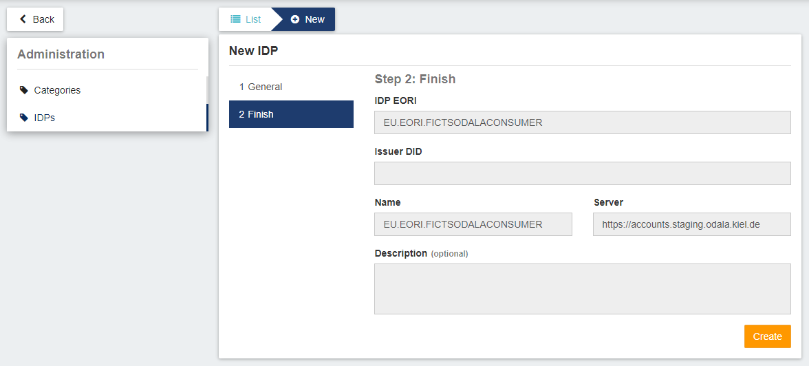
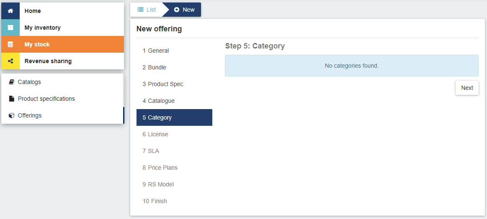
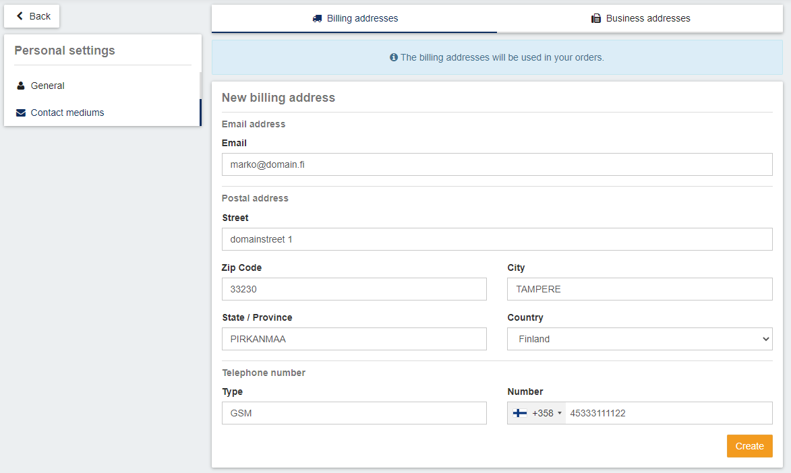

# 1. Marketplace

Marketplace is a service where sellers can create product listings and offerings for their products.

This marketplace utilizes i4trust plugin that contains all necessary authentication & authorization functions - when customer buys a service that provides an access into entities, i4trust plugin creates a policy for customer containing entity related information and customer's organization EORI number.

i4trust plugin is installed with Gitlab's CI/CD pipeline along with Marketplace.

## 1.2. Before deploying Marketplace: application registration into Keyrock

Before deploying marketplace into Kubernetes cluster, Keyrock administrator must register Marketplace into Keyrock instance.

### 1.2.1. Registering Marketplace into Keyrock

Register new application in Keyrock. Change `DOMAIN.fi` for Url and Callback Url. Make sure to check `Open ID Connect Authentication`.

### 1.2.2. Creating roles for Marketplace application

To get Marketplace functional for users, roles are needed for Marketplace. To do so, open the Marketplace application page in Keyrock and open the `Edit roles`. This opens a box containing roles.

Create these roles:

Aggrerator role:

Seller role:

Customer role:

Organization Admin role:

### 1.2.3. Assigning roles for users

After creation of roles, it is time to assign them for users.

Close the roles window and open `Authorize users`. There you can search users and assign roles for users.

Seller role is for users that are selling services in Marketplace. Assiging this role will provide several functions for user into Marketplace.

Customer role is for users that are buying services from sellers in Marketplace. Assigning this role will provide several functions for user into Marketplace

**NOTE: Do not assign any roles for admin account of Keyrock instance as this may compromise the security of Marketplace. Instead, create an separate admin account and assign orgAdmin and Aggregator role**

### 1.2.4. Obtaining OAuth2 related information of Marketplace application

In first page of Marketplace application, there are OAuth2 related information listed. Take OAuth2 credentials `Client ID` and `Client Secret` into Gitlab's CI/CD variables.

## 1.3. Configuring Marketplace

Configure `values.yaml` file in /values/ folder and replace all iSHARE related configurations with own iSHARE certificates.

**bizEcosystemChargingBackend:**
- token.identifier
- token.key
- token.cert

**bizEcosystemLogicProxy**
- token.identifier
- token.key
- token.cert

## 1.4. Activation Service

Activation Service is used as a proxy for creating policies. When Marketplace is creating a policy into Authorization Registry, it proxies it through Activation Service which forwards the policy into Authorization Registry.

### 1.4.1. Configuring Activation Service

Configure `values-as.yaml` file in /values/ folder and replace all iSHARE related configurations with own iSHARE certificates.

- config.client.id
- config.client.key
- config.client.cert

## 2.1. Using Marketplace - Administrator

When Marketplace instance is deployed, administrator must configure the instance of Marketplace.

### 2.1.1. Adding an external IDP

Login with local IDP as admin user:

From `Administration` panel and `IDPs` list, add an external IDP: 

**NOTE: In this case, EU.EORI.FICTSODALACONSUMER is seller and EU.EORI.FICTSODALAPROVIDER is customer**

## 2.2. Using Marketplace - Seller

To login into Marketplace, login with external IDP:

**NOTE: In this case, we use EU.EORI.FICTSODALACONSUMER**

### 2.2.1. Creating product

#### 2.2.1.1. Catalog

From `My stocks > Catalogs` create a new catalog:

After creation of catalog, put the catalog as active by clicking green ball in line. Make sure to click `Update` button after this:

####  2.2.1.2. Product

From `Product specifications` create a new product:

Add these information for product specification:

Click `GET` and add `*` to both fields. Leave other fields untouched and click `Next`:

After creation of product specification, click green ball from line to make it active.

### 2.2.2. Creating offering

From `My stocks > Offerings` create a new offering:

Click Product specification from list and click `Next` button:

Click Catalog from list and click `Next` button:

Disable the `Is an open offering?` option and click `Next` button:

Select RS Model from list and click `Next` button:

After creation of offering, put the offering as active by clicking green ball in line. Make sure to click `Update` button after this:

## 2.3. Using marketplace - Customer

Login with external IDP as customer:

**NOTE: In this case we are using EU.EORI.FICTSODALAPROVIDER**

### 2.3.1. Buying offering

After login, create new billing address from `User settings > Contact mediums`:

After creation of billing address, add an item in `Home` page by clicking `Add to cart` button:

After adding an item into cart, click `Checkout` button:

Click `Checkout` to acquire the item:

### 2.3.2. Access the offering

When acquiring is done, it is accessible from `My inventory > Products` page:

Access the data by clicking `Download` button:

**NOTE: You may need to click `Register the application` to register `Trusted Marketplace Portal` into `Keyrock` instance**

Login into `Trusted Marketplace Portal` by clicking `Login` text:

Fetch `CrowdFlowObserved` type:

---

# Known issues

1. Marketplace components may break down after a meanwhile, causing issues for marketplace features.

---

Components- Marketplace

for the ODALA project.

© 2022 Contrasec Oy

Contact: ilari.mikkonen@contrasec.fi

License EUPL 1.2

